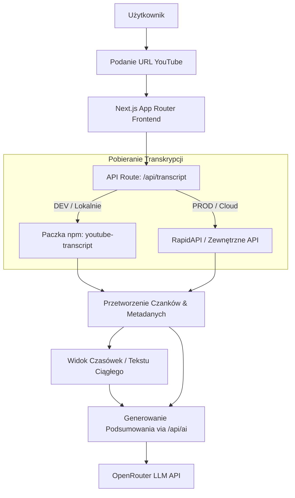

# 🎬 TubeDigest – YouTube Transcript & AI Analyzer

> **Zaawansowana aplikacja internetowa w Next.js do wyciągania transkrypcji wideo z YouTube, szybkiej obróbki tekstu oraz analizy za pomocą sztucznej inteligencji (AI Prompt Presets & Direct AI Analysis).**


---

## 🌟 Kluczowe Funkcje

### 📺 1. Wyciąganie i Prezentacja Transkrypcji

- **Obsługa dowolnych linków YouTube**: Standardowe `watch?v=`, skrócone `youtu.be/`, formaty `shorts/` oraz `embed/`.
- **Wykrywanie języków napisów**: Obsługa języka polskiego (pl), angielskiego (en) oraz automatycznego (auto fallback).
- **Dwa elastyczne widoki**:
  - **Widok Czasówek (Timestamps)**: Kafelki z dokładnymi znacznikami czasu odsyłającymi bezpośrednio do wybranego momentu w filmie. Grupowanie czanków (co 30s / 60s / oryginalne).
  - **Widok Tekstu Ciągłego (Continuous)**: Automatyczne łączenie w czytelne akapity do szybkiego czytania.
- **Wyszukiwarka fraz na żywo**: Błyskawiczne filtrowanie bloków tekstu zawierających szukane słowo kluczowe.
- **Jednoklikowy Eksport**: Możliwość pobrania transkrypcji w formatach `.txt`, `.md` (Markdown) oraz `.json`.

### 🤖 2. Szablony Promptów AI & Generowanie Podsumowań

- **Gotowe szablony zapytania dla LLM**:
  - `[ TL;DR ]` – Błyskawiczna synteza głównej tezy.
  - `[ Notatki i Punkty ]` – Ustrukturyzowane wypunktowanie wiedzy.
  - `[ Fact Check ]` – Identyfikacja twierdzeń wymagających weryfikacji.
  - `[ Weryfikacja Manipulacji ]` – Analiza sekcji pod kątem błędu poznawczego lub manipulacji.
  - `[ Tryb Nauki / Q&A ]` – Generowanie pytań sprawdzających i fiszek.
- **Jednoklikowe kopiowanie kompletnego promptu** wraz ze wklejonym pełnym tekstem wideo.
- **Symulacja analizy AI**: Podgląd sugerowanej odpowiedzi wewnątrz aplikacji bez użycia API key.
- **Bezpośrednie generowanie AI**: Integracja z modelami LLM (OpenRouter) dla użytkowników z odpowiednimi uprawnieniami.

### 🌓 3. Tryb Jasny i Ciemny (Light & Dark Mode)

- Pełna obsługa motywu **Light Mode** oraz **Dark Mode** w oparciu o czysty system MUI v9.
- Zapamiętywanie preferencji w `localStorage` oraz wygładzony przełącznik w nagłówku.

### 👤 4. System Użytkowników & Panel Administratora

- Autoryzacja kont oparta o **Clerk**.
- Zarządzanie rolami: Użytkownicy Basic, Plan PRO oraz Administrator.
- Panel Admina w profilu umożliwiający zarządzenie pakietami PRO i rolami użytkowników.
- **Lokalne Archiwum**: Historia przeglądanych materiałów zapisywana w przeglądarce (`localStorage`).

---

## 🏗️ Architektura Systemu



---

## 🛠️ Stack Technologiczny

- **Framework**: [Next.js 16](https://nextjs.org/) (App Router)
- **Biblioteka UI**: [React 19](https://react.dev/)
- **Język**: [TypeScript 5](https://www.typescriptlang.org/) (Strict mode)
- **Komponenty & Stylizacja**: [Material-UI (MUI v9)](https://mui.com/), `@mui/material-nextjs`
- **Autentykacja**: [Clerk Authentication](https://clerk.com/)
- **Ikony**: `@mui/icons-material`, `lucide-react`
- **Testowanie**: [Jest](https://jestjs.io/), `@testing-library/react`
- **CI/CD**: GitHub Actions (Lint, Typecheck, Test, Build)

---

## 🚀 Uruchomienie Projektu Lokalnie

### Wymagania wstępne

- Node.js `v18.x` lub nowszy
- Menedżer pakietów `npm`, `pnpm` lub `yarn`

### 1. Klonowanie repozytorium

```bash
git clone https://github.com/AlenJakob/yt-transcript-analyzer.git
cd yt-transcript-analyzer
```

### 2. Instalacja zależności

```bash
npm install
```

### 3. Konfiguracja zmiennych środowiskowych `.env.local`

Utwórz plik `.env.local` w głównym katalogu projektu i uzupełnij klucze:

```env
# Clerk Auth
NEXT_PUBLIC_CLERK_PUBLISHABLE_KEY=pk_test_...
CLERK_SECRET_KEY=sk_test_...

# OpenRouter (Generowanie AI)
OPENROUTER_API_KEY=sk-or-v1-...
NEXT_PUBLIC_SITE_URL=http://localhost:3000
```

### 4. Uruchomienie serwera deweloperskiego

```bash
npm run dev
```

Aplikacja będzie dostępna pod adresem: [http://localhost:3000](http://localhost:3000).

---

## 🧪 Skrypty Deweloperskie & Testowanie

| Polecenie          | Opis                                               |
| :----------------- | :------------------------------------------------- |
| `npm run dev`      | Uruchamia serwer deweloperski Next.js z Hot Reload |
| `npm run build`    | Kompiluje aplikację                                |
| `npm run start`    | Uruchamia serwer produkcyjny                       |
| `npm run lint`     | Uruchamia sprawdzanie jakości kodu (ESLint)        |
| `npm test`         | Uruchamia zestaw testów jednostkowych (Jest)       |
| `npx tsc --noEmit` | Weryfikacja spójności typów TypeScript             |

---

## 📁 Struktura Katalogów

```text
yt-transcript-analyzer/
├── .github/workflows/     # Konfiguracja CI/CD GitHub Actions
├── public/                # Zasoby statyczne (obrazy, favicon)
├── src/
│   ├── app/               # Next.js App Router (Strony & API Routes)
│   │   ├── api/           # API Routes (/transcript, /ai)
│   │   ├── archive/       # Strona archiwum historii
│   │   ├── profile/       # Strona profilu i panelu admina
│   │   ├── layout.tsx     # Główny układ aplikacji
│   │   └── page.tsx       # Strona główna z analizatorem
│   ├── components/        # Modułowe komponenty React (MUI v9)
│   │   ├── AiPresets/     # Komponenty szablonów promptów AI
│   │   ├── ArchiveView/   # Komponenty widoku archiwum
│   │   ├── TranscriptViewer/ # Komponenty przeglądarki transkrypcji
│   │   ├── Header.tsx     # Nagłówek z przełącznikiem trybu Jasnego/Ciemnego
│   │   └── ThemeRegistry.tsx # Rejestr motywu MUI
│   ├── context/           # React Context (ColorModeContext dla trybu jasnego/ciemnego)
│   ├── hooks/             # Dedykowane hooki (useAuthUser, useTranscriptArchive, etc.)
│   ├── lib/               # Usługi pomocnicze (youtube transcript parser, auth, storage)
│   ├── theme/             # Definicje motywów MUI (darkTheme & lightTheme)
│   └── types/             # Interfejsy i typy TypeScript
├── README.md              # Dokumentacja projektu
└── tsconfig.json          # Konfiguracja TypeScript
```

---

## 🛡️ Licencja

Projekt dystrybuowany na licencji **MIT**.
